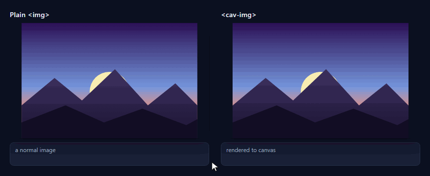
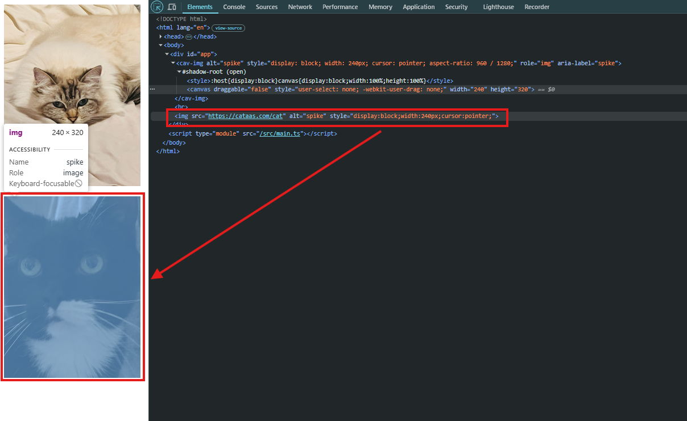
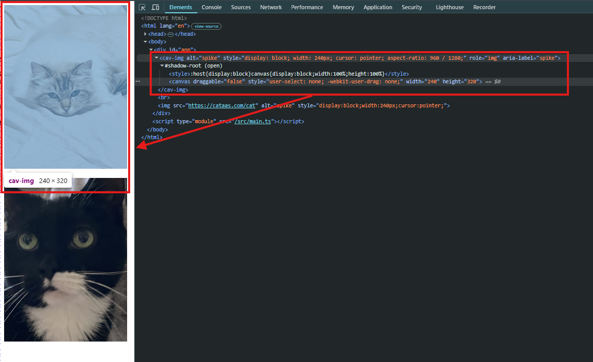

# cavimg

Render an image to a `<canvas>` so it is harder to **casually** copy: no `` to
right-click-save, no drag-to-desktop, and the URL is kept out of the DOM inspector.
Framework-agnostic Web Component (`<cav-img>`). **Casual deterrence only** — see
[Limitations](#limitations) and the [threat matrix](docs/threat-matrix.md).



> The cursor and right-click menu in the demo are a stylized illustration; the
> underlying behavior (menu/drag blocked on `<cav-img>`, no `` in the DOM) is
> real and verified by the Playwright E2E in [`e2e/`](e2e/).

## How it protects — see it in the inspector

A normal `` puts the image URL right in the DOM, ready to right-click →
*Save image as…*. A `<cav-img>` renders the pixels to a `<canvas>` inside a shadow
root and **scrubs the `src` from the DOM** — the inspector shows no URL to grab.

| Plain `` — URL exposed | `<cav-img>` — URL hidden |
|:---:|:---:|
|  |  |

Left: the `` — the URL sits right there in the
Elements panel, one right-click from being saved. Right: the same image via
`<cav-img>` — `role="img"`, an open shadow root with a `<canvas draggable="false">`,
and **no `src` attribute**. There is nothing in the DOM to copy.

## Install
```bash
npm i cavimg
```
CDN: `<script src="https://cdn.jsdelivr.net/npm/cavimg"></script>` (registers `<cav-img>`).

## Quick start
- **HTML / Vite:** `import 'cavimg'` then `<cav-img src="…" alt="…"></cav-img>`
- **Next.js:** register client-side — `useEffect(() => { import('cavimg').then(m => m.defineCavImg()); }, [])` (Web Components are client-only). See `examples/next`.
- **Angular:** add `CUSTOM_ELEMENTS_SCHEMA`, call `defineCavImg()`. See `examples/angular`.

## API
- Attributes: `src`, `fit` = `contain` (default) | `cover` | `fill`, `alt`.
- Properties: `el.src` (get/set, returns the retained URL), `el.fit`, `el.load(url)`.
- Events: `cav-load`, `cav-error`. Functional API: `renderToCanvas(canvas, url, { fit })`.

## Before / after (identical pixels)
Static proof (the animation above shows it live). Both render the identical image;
only the DOM and behavior differ — the protection is structural, not visual. Left is
a normal `` (right-click saves it); right is a `<cav-img>` canvas (no save, no
drag, no URL in the inspector). The screenshots are pixel-identical by design — see
the DOM evidence above.

| | Plain `` (before) | `<cav-img>` (after) |
|---|---|---|
| Vite |  |  |
| Next.js |  |  |
| Angular |  |  |

DOM evidence (from `images/dom-<app>.json`): the `<cav-img>` has **no ``** and
**no `src` attribute** after load, while the plain control exposes its `src`.

## Performance impact
Measured via Playwright over the `examples/` apps: time from page start to each
element's ready state, loading the same 1200×800 fixture. `overheadMs` is cavimg's
extra decode→`ImageBitmap`→canvas-draw cost over a native ``. These are
**single-run, localhost measurements** (not averaged over multiple runs), so small
or negative deltas are timing noise, not a real speedup.

| Framework | Plain img (ms) | cav-img (ms) | Overhead (ms) | JS heap at load |
|-----------|----------------|--------------|---------------|-----------------|
| Vite | 30 | 29 | -1 | ~10.0 MB |
| Next.js | 33 | 31 | -2 | ~11.9 MB |
| Angular | 56 | 68 | +11 | ~10.0 MB |

Takeaway: for Vite and Next.js the measured overhead is within single-run localhost
timing noise (it even reads slightly negative). Angular shows a measurable ~11ms cost
in this run. The overhead is small and dominated by noise for light setups, with a
real single-digit-to-~10ms decode/draw cost that scales with image dimensions. cavimg
redraws responsively from a cached `ImageBitmap` (no refetch on resize/remount).

## Limitations
Casual deterrence only. It does **not** stop the Network tab, `canvas.toDataURL()`,
screenshots, or headless scraping. `crossOrigin="anonymous"` means images from hosts
without CORS headers fail to load (`cav-error`). Full accounting:
[docs/threat-matrix.md](docs/threat-matrix.md).

## Development
pnpm monorepo. `pnpm --filter cavimg build` · `pnpm --filter cavimg test`. Example
apps in `examples/` and E2E in `e2e/` are dev-only. Regenerate the demo GIF with
`pnpm --filter @cavimg/e2e run showcase`. E2E: see the plan in
`docs/superpowers/plans/2026-07-23-cavimg-examples-e2e-docs.md`.
